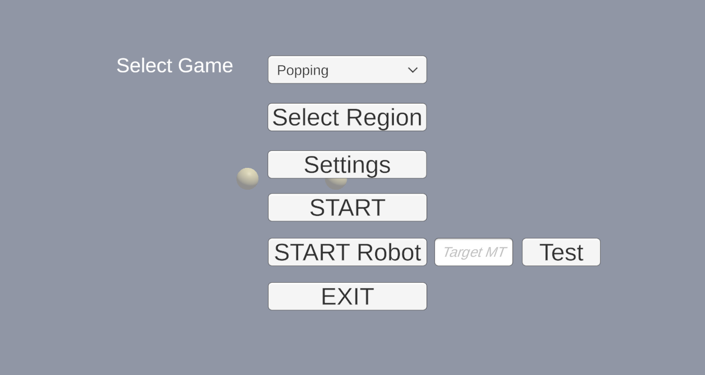

# THRIVE System
 

# Instructions to Run THRIVE System

## Setup

1. Connect the wireless router to a power outlet. The white LED indicator should light up in solid white color.
2. Connect the Kinect's USB port to the PC and connect the Kinect's power cable to a power source.
3. Open the computer and ensure you are connected to the network **Linksys00605**.
4. Connect the robot power by switching the power button to the **ON** position.
5. Wait until the robot boots up. When you hear **"Hello World,"** proceed to the next step.

## Running the Game and Robot

6. Open the Kinect Game. Click on **Test**; the robot will enter **Self-introduction** mode.
7. Click on **Start** to play a game without the robot.
8. At the end of the game, please write down the **Average Movement Time** and **Target Movement Time**.
9. Click **Next**, and enter the Target Movement Time in the box labeled **Target MT**.
10. Click **Start Robot** to begin the interaction.

### setup new robot
sudo nano /etc/systemd/system/robot2.service
sudo systemctl start robot2.service
sudo systemctl status robot2.service

## setup static ip address
admin@raspberrypi:~ $ nmcli connection show
NAME                UUID                                  TYPE      DEVICE 
preconfigured       bab1e090-17e1-417d-bbee-9f67344bf3d7  wifi      wlan0  
lo                  1742d74f-ea92-4767-9e5e-b31860520e96  loopback  lo     
Wired connection 1  a537414c-649c-34ab-bb22-70d57162342b  ethernet  --     

admin@raspberrypi:~ $ sudo nmcli connection modify "preconfigured" ipv4.addresses 192.168.1.200/24
admin@raspberrypi:~ $ sudo nmcli connection modify "preconfigured" ipv4.gateway 192.168.1.1
admin@raspberrypi:~ $ sudo nmcli connection modify "preconfigured" ipv4.dns "8.8.8.8 8.8.4.4"
admin@raspberrypi:~ $ sudo nmcli connection modify "preconfigured" ipv4.method manual
admin@raspberrypi:~ $ ip -a

# Instructions for Automatically Running `robot_ready.sh` on Boot

sudo nano /etc/systemd/system/robot_ready.service

[Unit]
Description=Robot Ready Service
After=network-online.target
Wants=network-online.target

[Service]
ExecStart=/bin/bash /home/admin/THRIVE-System/service/robot_ready.sh
Type=simple

[Install]
WantedBy=multi-user.target

sudo systemctl enable robot_ready.service
sudo systemctl start robot_ready.service

sudo reboot