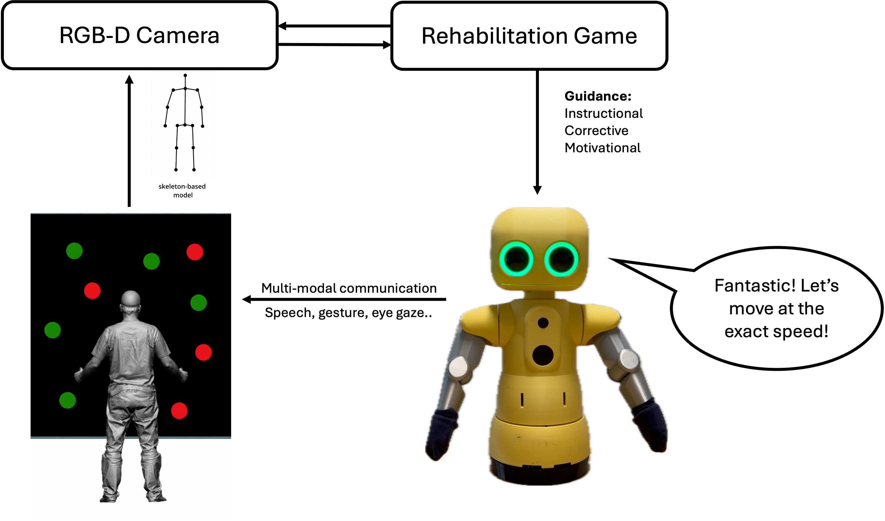
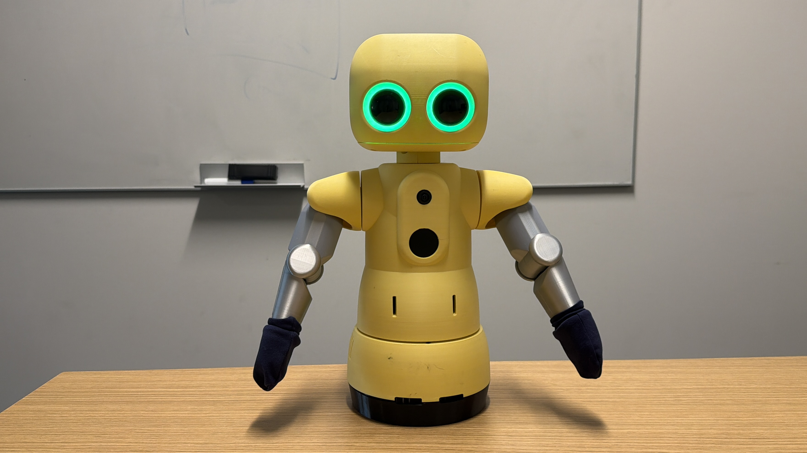

# THRIVE System

## The Robot

## Documentation

| Page | What it covers |
|---|---|
| [operation.md](operation.md) | Running a THRIVE session with a physical robot or a remote-presence robot: setup, playing the game, and troubleshooting. |
| [robot-setup.md](robot-setup.md) | Setting up the Raspberry Pi that drives the physical robot — static IP, Python environment, and the auto-start service. |
| [unity-dev-setup.md](unity-dev-setup.md) | Getting the Unity project running, and connecting it to either a physical robot or a remote-presence robot. |
| [status.md](status.md) | Inventory of all deployed THRIVE systems and their current status. |
