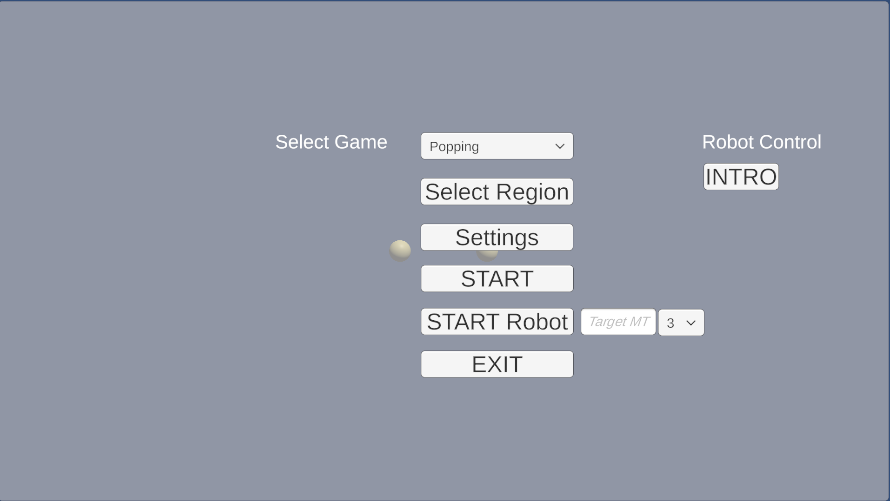

# THRIVE System
 

# Instructions to Run THRIVE System

## Setup

1. Connect the wireless router to a power outlet. The white LED indicator should light up in solid white color.
2. Connect the Kinect's USB port to the PC and connect the Kinect's power cable to a power source.
3. Open the computer and ensure you are connected to the network **Linksys00605**.
4. Connect the robot power by switching the power button to the **ON** position.
5. Wait until the robot boots up. When you hear **"Hello World,"** proceed to the next step.

## Running the Game and Robot



6. Open the Kinect Game. Click on **Test**; the robot will enter **Self-introduction** mode.
7. Click on **Start** to play a game without the robot.
8. At the end of the game, please write down the **Average Movement Time** and **Target Movement Time**.
9. Click **Next**, and enter the Target Movement Time in the box labeled **Target MT**.
10. Click **Start Robot** to begin the interaction.

## Trouble Shooting
1) no camera feed, check whether cables and power are connected properly; check firmware/driver
2) have camera feed but no tracking.
3) robot not respond: make sure laptop are on the wifi network. use VNC viewer to remotely login the respberry pi check status. both username and password are admin. 

## Running Remote Mode (Unity Robot Video/Audio)

Remote mode lets the Unity game trigger the on-screen robot video/audio reactions (Hello, Say, Celebrate, Standby) by sending commands to `remote_robot/video_server.py` over the network.

1. On the PC running the robot's video/audio display, start the video server first by double-clicking **`remote_robot/dist/video_server/video_server.exe`**. A console window should open and a Standby video should start playing.
   - If you don't have the exe built yet, you can instead run `python remote_robot/video_server.py` from the project's `.venv`.
   - Windows Firewall may prompt to allow the app on first run — click **Allow**, since it needs to listen for incoming connections.
2. Note the PC's IP address shown in the console output (e.g. `Running on http://<ip>:12345`) — Unity needs this to connect.
3. Open the Unity game and make sure it's configured to send commands to that PC's IP on TCP port **23456**.
4. Run the Unity game as normal. As the game sends commands, the video server will play the matching video (muted) together with a random matching audio clip, then return to Standby when finished.
5. To stop remote mode, close the `video_server.exe` console window (or press **Ctrl+C** if running from `python`).

### Deploying `video_server.exe` to another laptop

The paths in `video_server.py` are resolved relative to the exe itself, so it's portable as long as this folder structure is kept together:

```
THRIVE-System/
├── audio_files/            (intro, same, faster, end)
└── remote_robot/
    ├── dist/
    │   └── video_server/
    │       ├── video_server.exe
    │       └── _internal/   (required — bundled Python/dependencies)
    └── videos/
```

To set up a new laptop:
1. Copy the `remote_robot` folder (including `dist/` and `videos/`) and the `audio_files` folder to the new laptop, keeping them siblings as shown above.
2. Install **VLC media player** (64-bit) on the new laptop — `video_server.exe` depends on it being installed, it isn't bundled.
3. Run `remote_robot/dist/video_server/video_server.exe`. Allow it through Windows Firewall if prompted, and click "Run anyway" if Windows SmartScreen warns about an unrecognized app.

**If the exe closes immediately on a new laptop (likely antivirus):** this is a common false positive for PyInstaller-built exes — some AV engines flag them as suspicious because similar tools also self-extract files at runtime. The exe is built with `--onedir` (a plain folder of files, no self-extraction) specifically to minimize this, but a particular AV product may still block it. If it still closes:
- Check the AV's quarantine/threat history (e.g. Windows Security → Protection history) to confirm it was actually blocked, and by what.
- Add an exclusion for the `remote_robot/dist/video_server` folder in the AV settings.
- Report it to the AV vendor as a false positive if the above works — it usually gets whitelisted after review.

## setup static ip address
admin@raspberrypi:~ $ nmcli connection show

You should see output like:
NAME                UUID                                  TYPE      DEVICE 
preconfigured       bab1e090-17e1-417d-bbee-9f67344bf3d7  wifi      wlan0  
lo                  1742d74f-ea92-4767-9e5e-b31860520e96  loopback  lo     
Wired connection 1  a537414c-649c-34ab-bb22-70d57162342b  ethernet  --     

Modify the network connection with the desired static IP:
sudo nmcli connection modify "TP-Link_2110" ipv4.addresses 192.168.0.106/24
sudo nmcli connection modify "TP-Link_2110" ipv4.gateway 192.168.1.1
sudo nmcli connection modify "TP-Link_2110" ipv4.dns "8.8.8.8 8.8.4.4"
sudo nmcli connection modify "TP-Link_2110" ipv4.method manual

<!-- 
admin@raspberrypi:~ $ sudo nmcli connection modify "preconfigured" ipv4.gateway 192.168.1.1
admin@raspberrypi:~ $ sudo nmcli connection modify "preconfigured" ipv4.dns "8.8.8.8 8.8.4.4"
admin@raspberrypi:~ $ sudo nmcli connection modify "preconfigured" ipv4.method manual -->

admin@raspberrypi:~ $ ip -a

sudo reboot

# Setup Environment
cd THRIVE-System
python3 -m venv myenv
source myenv/bin/activate
pip install -r requirements.txt

change the IP address of the robot in run_robot.py

# Instructions for Automatically Running `robot_ready.sh` on Boot

sudo nano /etc/systemd/system/robot_ready.service

[Unit]
Description=Robot Ready Service
After=network-online.target
Wants=network-online.target

[Service]
ExecStart=/bin/bash /home/admin/THRIVE-System/service/robot_ready.sh
Type=simple
Environment="XDG_RUNTIME_DIR=/run/user/1000"
User=admin
Group=audio
Restart=on-failure
RestartSec=1 

[Install]
WantedBy=multi-user.target


# then run the following
sudo systemctl enable robot_ready.service
sudo systemctl start robot_ready.service

sudo reboot

# reload and try again
sudo systemctl daemon-reexec
sudo systemctl daemon-reload
sudo systemctl enable robot_ready.service
sudo systemctl start robot_ready.service

# For debug, use below to print the log
journalctl -u robot_ready.service --no-pager -n 50


