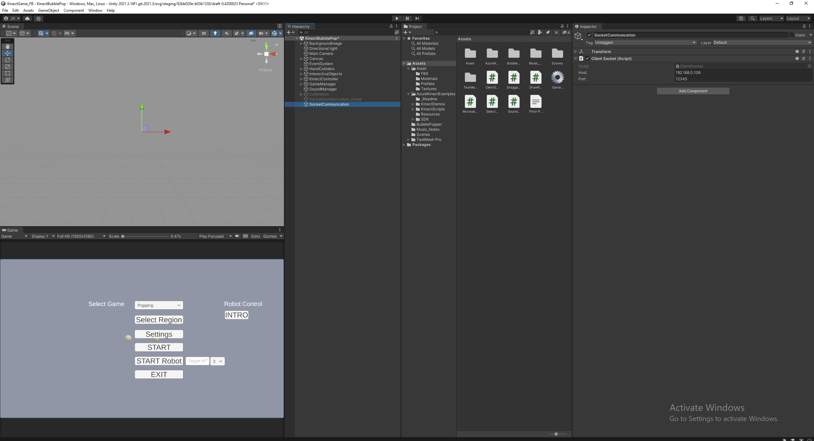
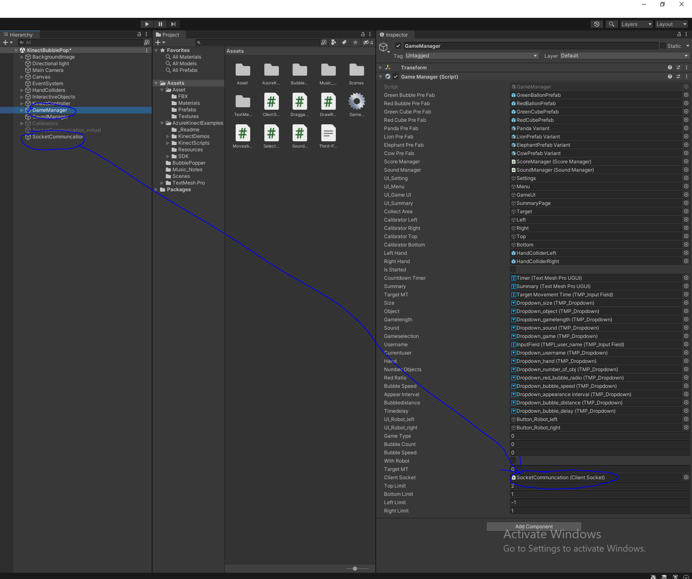
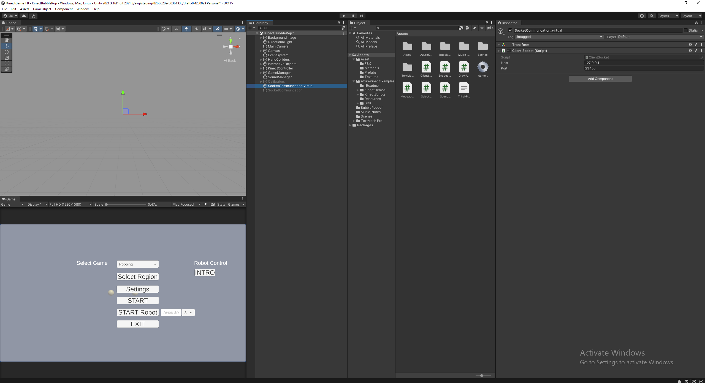
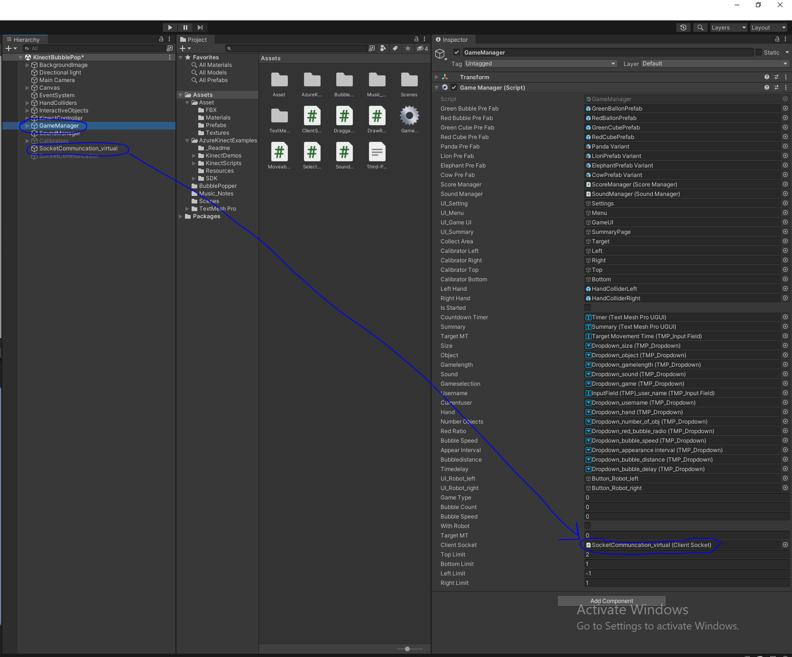
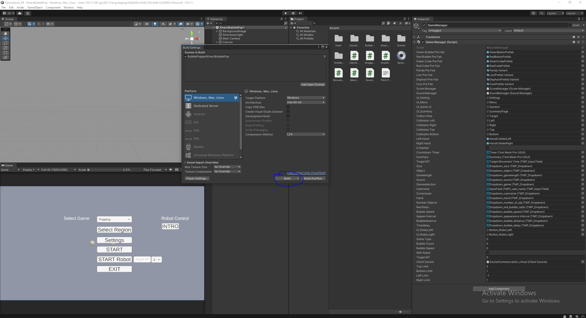

# Unity Dev Environment Setup

How to get the Unity project running, and how to connect it to either a **physical robot** (the real hardware, via Raspberry Pi) or a **remote-presence robot** (a video/audio stand-in running on a PC, no hardware required).

## Install Unity

1. If you're new to Unity, go through the basics first at **[learn.unity.com](https://learn.unity.com/)** before working with this project.
2. Install **[Unity Hub](https://unity.com/download)**.
3. From Unity Hub, install the Unity Editor version **2021.3.16f1** specifically — the project needs this exact version to open and run without errors.
4. You'll need a Unity account to get a free personal license — register one (or sign in) when Unity Hub prompts you for it.

## Getting the project

- **If you're on the Alienware laptop:** the project source is already there at `C:\Jin\KinectGame_FB` — just open it directly in Unity.
- **Otherwise:** download the project as a `.zip` from Google Drive:
  https://drive.google.com/file/d/17-hn4JNmXNct6bGhg7TxpWi_hAbIJuXQ/view?usp=sharing

  If you don't already have access, click **Request access** on that page and wait for it to be granted before downloading. Once downloaded, unzip it and open the resulting folder in Unity.

## Setting up the camera driver

1. Install the **[Azure Kinect SDK](https://www.microsoft.com/en-us/download/details.aspx?id=101454)**.
2. Install the **[Azure Body Tracking SDK](https://www.microsoft.com/en-us/download/details.aspx?id=104221)**.
3. Download, unzip, and run **[Orbbec Viewer](https://github.com/orbbec/OrbbecSDK/releases)** (v1.8.1 or later). Select the connected camera and check the quality of its color, depth, IR, and IMU streams. Also check that the device timestamps are rolling. Then close Orbbec Viewer.
4. Download and unzip **[Orbbec's K4A-Wrapper](https://github.com/orbbec/OrbbecSDK-K4A-Wrapper/releases)** (v1.8.1 or later). Run the `k4aviewer` app located in its `bin` folder, open the connected device, and start the cameras. Check again that the IR, depth, color, and IMU streams are visible, the timestamps are rolling, and there are no errors in the console. Then stop the cameras, close the device, and close K4A Viewer.

**Troubleshooting reference:** [Azure Kinect Tips & Tricks](https://rfilkov.com/2019/08/26/azure-kinect-tips-tricks/#t19)

## Connecting to a physical robot

The physical robot is a Raspberry Pi (see [robot-setup.md](robot-setup.md) for how it's set up) running `run_robot.py`, which listens on a plain TCP socket at the Pi's static IP, port **12345**. In the Unity Hierarchy, this connection is the `SocketCommunation` GameObject.

1. In the Hierarchy, **enable** `SocketCommunation` and select it. In its Inspector, set **Host** to the robot's IP address — make sure it matches the actual IP of the robot you're connecting to (see [robot-setup.md](robot-setup.md) / [status.md](status.md) for which IP belongs to which system). Leave **Port** at `12345`.

   

2. **Disable** `SocketCommunation_virtual` (it should not be active at the same time as `SocketCommunation`).
3. Select the `GameManager` GameObject, and in its Inspector drag `SocketCommunation` onto the **Client Socket** field.

   


## Connecting to a remote-presence robot

The remote-presence robot lets Unity trigger the same kind of reactions (video + audio) on a plain PC display, without any physical hardware — useful for development or when a physical robot isn't available on-site. In the Unity Hierarchy, this connection is the `SocketCommunation_virtual` GameObject.

1. **Enable** `SocketCommunation_virtual`.
2. **Disable** `SocketCommunation`.

   

3. In `GameManager`, drag `SocketCommunation_virtual` to **Client Socket**.

   


### Running `video_server.py`

```
cd remote_robot
source .venv/Scripts/activate
python video_server.py
```

### Deploying the remote-presence robot to another laptop

The paths in `video_server.py` are resolved relative to the script itself, so it's portable as long as this folder structure is kept together:

```
THRIVE-System/
├── audio_files/            (intro, same, faster, end)
└── remote_robot/
    ├── videos/
    ├── video_server.py
    ├── pyproject.toml
    └── uv.lock
```

To set up a new laptop:
1. Copy the `remote_robot` folder and the `audio_files` folder to the new laptop, keeping them siblings as shown above.
2. Install **VLC media player** (64-bit) from https://www.videolan.org/vlc/download-windows.html.
3. In a terminal, `cd` into `remote_robot` and run:
   ```
   uv sync
   ```

## Building the Unity game as an executable

For non-technical users (e.g. physical therapists or students), we build the Unity game into a standalone executable and copy the built files to other computers, so they don't need Unity installed to run it.

1. In Unity, go to **File → Build Settings**.
2. Click **Build**, and choose a target folder for the build output.

   

3. Once the build finishes, copy the entire output folder to the target computer and run the `.exe` from there — same as with `KinectGame.exe` in [operation.md](operation.md).

## Example: Setting Up a New Laptop to Run the Game with a Robot

1. Install all the camera libraries — see [Setting up the camera driver](#setting-up-the-camera-driver) above.
2. In Unity, compile the executable with the robot's IP address already set up correctly — see [Connecting to a physical robot](#connecting-to-a-physical-robot) for setting the Host IP, then [Building the Unity game as an executable](#building-the-unity-game-as-an-executable) above.
3. Transfer the built files to the new laptop.
4. Test it on the new laptop before handing it over.
